这篇是关于LLM的一些笔记和乱七八糟想法，未必正确。

OpenAI一开始就是大佬云集+资金充裕，想要搞出通用人工智能的。看了下GPT-1的几个作者，Alec Radford，他也是DCGAN的一作，15年发表，15k引用。

还有BERT一开始比GPT-1火，看有人说是因为BERT的完形填空确实比GPT-1的生成要简单，所以一开始BERT会有更好的效果

BERT是在拟合 $P(x_i|x_1, ...,x_{i-1}, x_{i+1},...,x_n)$，GPT是 $P(x_i|x_1, ...,x_{i-1})$

所以对大量文本本身的学习导致了GPT的很强的few-shot, zero-shot泛化能力。GPT1到3里面，GPT1即提出了zero-shot能力，GPT2开始增加规模，Scaling Laws讨论了模型规模对loss的影响，总之openai一直是在做同一件事。

**let's think step by step** 不是玄学，它相当于告诉模型需要一步一步推理，不要一下生成答案。比如让模型step by step地回答"去阿拉斯加旅游需要做哪些准备"，模型就会先输出"纬度高"→"天气冷"→"带上羽绒服"，而不是直接给一个笼统的答案。这个事情对于人类而言是常识，但让模型算Dijkstra就不行了。

## Scaling Laws for Neural Language Models

一个对LLM的理论研究，结论就是大力出奇迹。大模型和大量数据才能得到更好的效果。

### 核心结论

- 模型表现和规模强相关，和模型的shape弱相关：规模包括模型参数量N（不包括embedding）、数据集大小D和计算量C
- 幂方法则：对于N、D、C三个因素，模型表现和每个因素成**幂方关系**

  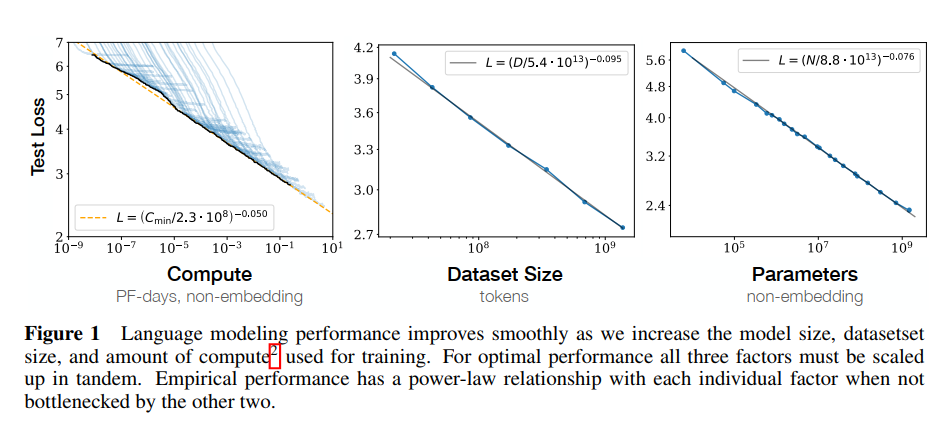

- 数据和模型参数量的比例关系大致为 $N^{0.74}/D$，也就是**模型参数增大8倍，数据也需要增大5倍**

- Sample efficiency：大模型能在更少的step内达到相同的性能

## Codex

基于GPT的模型架构，在GitHub上微调，可以用来编写Python代码。

目标函数没有使用BLEU，而是使用**pass@k**来评估模型，即生成n个输出（n>k），从中随机抽取k个，输出通过单元测试的概率。

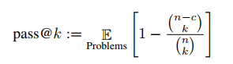

## InstructGPT

无论是"一个问题后面接一个回答"，还是"一个问题后面接另一个问题"，都是训练语料中可能经常出现的**模式**。这就是问题所在——如何让经过大规模语料预训练的模型**在输出时符合人类的期待**？

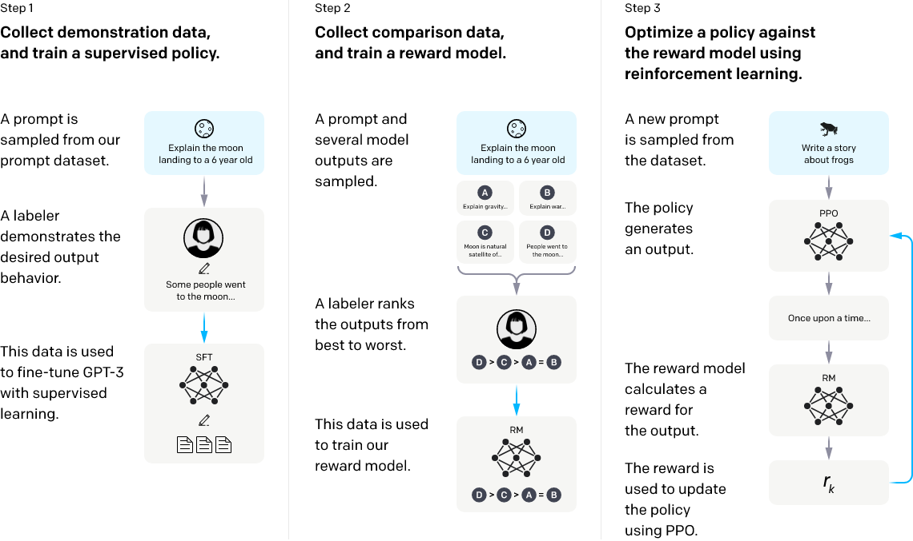

- **V0**（GPT-3）→ 人工构造少量数据 fine-tune → **V1**
- 让V1对同一prompt做多个输出，人工排序，训练一个**RM**（reward model）
- 用RL不断优化V1，得到**V2**（InstructGPT）

## T5 (Google)

Text-to-Text Transfer Transformer：所有NLP任务统一为text-to-text格式，一个模型干所有任务。

提出了C4 corpus。模型为encoder-decoder结构，参数量约为BERT两倍。

BERT只适合做分类，不适合做生成；T5则两者都能做。

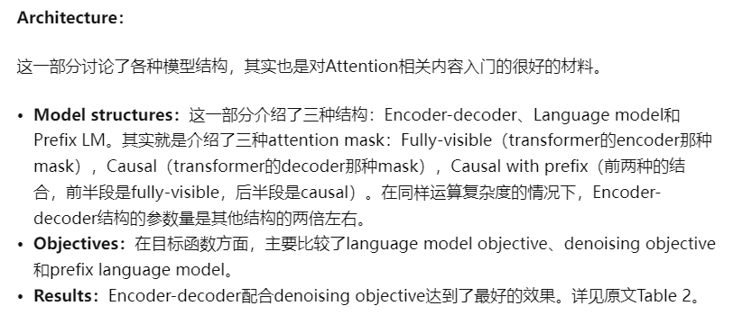

## Switch Transformers

1.6万亿参数，使用**Mixture of Experts（MoE）**，只激活部分参数，所以**算起来还比较快**。

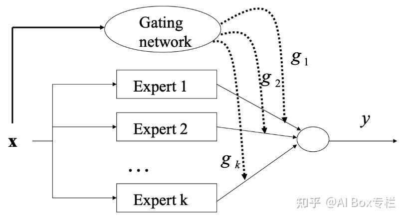

将FFN替换为多个Expert，每个token只路由到一个Expert（sparse routing），减少计算量。

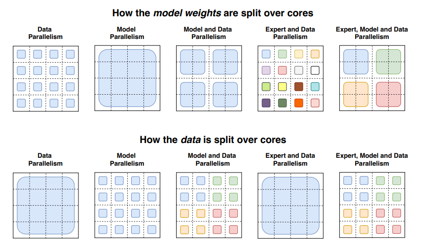

## 1. LoRA (Low-Rank Adaptation)

冻结预训练权重，向Transformer每层注入可训练的低秩矩阵，大幅减少下游任务的可训练参数量。

优点：
1. 一个大模型 + 多个小LoRA模块，对应不同任务
2. 训练更快
3. 推理无额外延迟（可以将LoRA矩阵合并进原始权重）

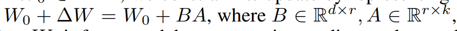

将 $\Delta W$ 表示为 $BA$，其中 A 用随机高斯初始化，B=0，训练过程中只更新A和B。

$$W' = W + \Delta W = W + BA$$

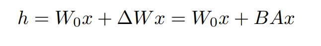

## 2. Diffusion Models

**Deep Unsupervised Learning using Nonequilibrium Thermodynamics**：用物理扩散过程建模，定义了前向加噪过程和反向去噪过程。

## 3. Latent Diffusion Models (Stable Diffusion)

解决原始Diffusion计算成本高的问题，分两阶段：

1. 训练autoencoder，将图像压缩到低维latent space
2. 在latent space上训练Diffusion model

用cross-attention实现条件控制（text-to-image）。

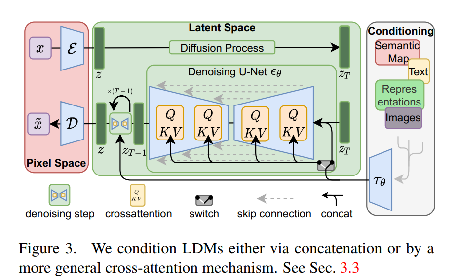

Downsampling factor 4~16 最优：太小给Diffusion太多负担，太大则损失信息。

## 6. DoRA: Weight-Decomposed Low-Rank Adaptation

研究发现：finetune时权重的magnitude和direction变化关系不大，而LoRA基本上是正比的（方向变化和幅度变化高度相关）。DoRA将权重分解为magnitude和direction分别优化，使其更像finetune。

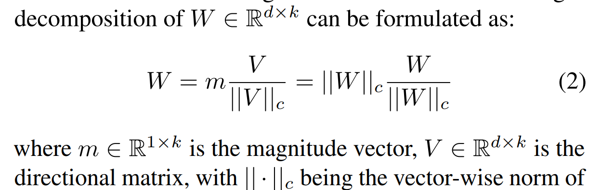

$$W = m \cdot \frac{V}{||V||_c}, \quad m = ||W_0||_c, \quad V \text{ trained with LoRA}$$

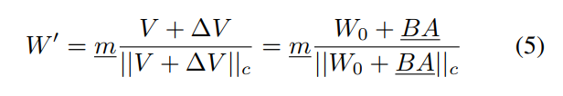

## 7. VeRA: Vector-Based Random Matrix Adaptation

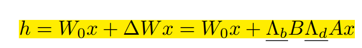

A和B是随机初始化、固定的矩阵；只训练对角阵b和d，参数量更少。

## 9. Weight Normalization

将权重向量分解为方向和幅度分别参数化，加速训练收敛。

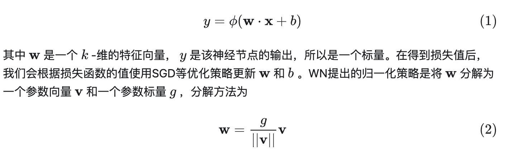
