## Multi-Head Attention 代码

```python
import torch
import torch.nn as nn
import torch.nn.functional as F
import math

class MultiHeadAttention(nn.Module):
    def __init__(self, d_model, num_heads):
        super().__init__()
        self.num_heads = num_heads
        self.d_model = d_model
        assert d_model % num_heads == 0
        self.d_k = d_model // num_heads
        self.W_q = nn.Linear(d_model, d_model)
        self.W_k = nn.Linear(d_model, d_model)
        self.W_v = nn.Linear(d_model, d_model)
        self.W_o = nn.Linear(d_model, d_model)

    def scaled_dot_product_attention(self, Q, K, V, mask=None):
        QK = torch.matmul(Q, K.transpose(-2, -1)) / math.sqrt(self.d_k)
        if mask is not None:
            QK = QK.masked_fill(mask == 0, float('-inf'))
        weights = F.softmax(QK, dim=-1)
        return torch.matmul(weights, V), weights

    def split_heads(self, x, batch_size):
        return x.view(batch_size, -1, self.num_heads, self.d_k).transpose(1, 2)

    def forward(self, q, k, v, mask=None):
        batch_size = q.size(0)
        q = self.split_heads(self.W_q(q), batch_size)
        k = self.split_heads(self.W_k(k), batch_size)
        v = self.split_heads(self.W_v(v), batch_size)
        scores, _ = self.scaled_dot_product_attention(q, k, v, mask)
        concat = scores.transpose(1,2).contiguous().view(batch_size, -1, self.d_model)
        return self.W_o(concat)
```

面试技巧：一次大矩阵乘法比多次小矩阵乘法快，可以用一个Linear层同时生成Q、K、V：

```python
self.qkv = nn.Linear(d_model, 3 * d_model)
qkv = self.qkv(x)
q, k, v = torch.split(qkv, d_model, dim=-1)
```

## LDA (Linear Discriminant Analysis)

将数据投影到一条线上，选择使类内方差最小、类间方差最大的方向。

$$J = \frac{w^T S_b w}{w^T S_w w}$$

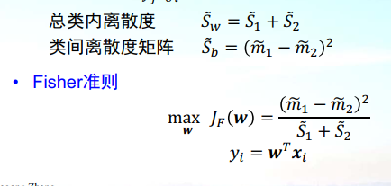

## Linear Regression

基本假设：自变量为线性，自变量之间独立，误差独立，误差方差恒定，误差服从正态分布。

$$w = (X^TX)^{-1}X^Ty$$

$X^TX$ 不可逆时：

- 用 **SVD**：$w = V\Sigma^{-1}U^Ty$（即X的伪逆）
- 用 **L2正则化**：$(X^TX + \lambda I)w = X^Ty$

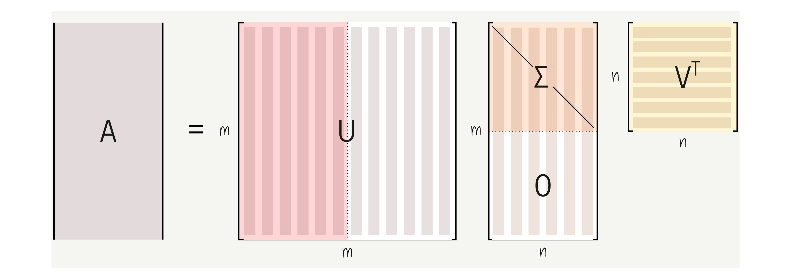

## Logistic Regression

优化cross entropy等价于优化NLL，两者是从信息论和概率论两个角度看同一个问题。

**用MSE做Logistic Regression是convex problem吗？**

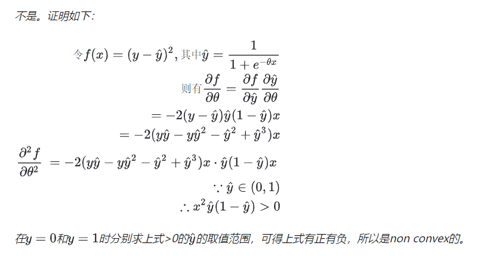

## Kmeans

缺点：需要人为设定K；对初始值和异常值敏感；假定每类为球形；不能处理离散值。

选择K值：手肘法

## GMM

GMM的EM与Kmeans的区别：
- E步：计算每个点属于每类的**概率**（软分配），而非直接分类

  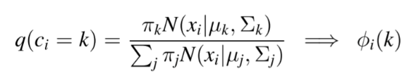

- M步：按概率加权计算新的分布参数

  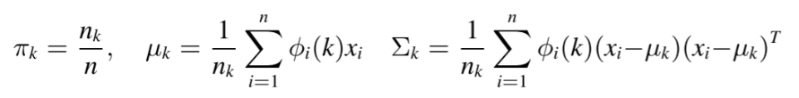

kmeans是硬分配，GMM是软分配；kmeans相当于认为各类分布均为单位方差高斯分布。

## 生成模型

GMM、HMM、朴素贝叶斯、贝叶斯网络、GAN、VAE、GPT、DALL-E……

生成模型学习 $P(x,y)$，判别模型学习 $P(y|x)$。

## Ridge & Lasso（L2 & L1）

- **L2（Ridge）**：参数先验为高斯分布
- **L1（Lasso）**：参数先验为拉普拉斯分布，产生稀疏解

为什么L1稀疏：

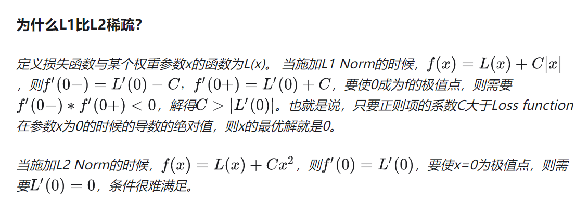

## 数据不平衡

假设正例少、负例多：增大正例采样率、舍弃部分负例、调整阈值、使用XGBoost等集成学习、生成正例、使用precision@k等指标。

## 集成学习

- **Bagging**：并行，如Random Forest

  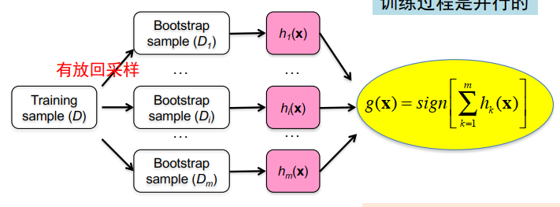

- **Boosting**：串行，如XGBoost

## 信息论：各种熵

- **自信息**：$-\log P(x)$
- **香农熵**：$H(X) = -\sum P(x)\log P(x)$

  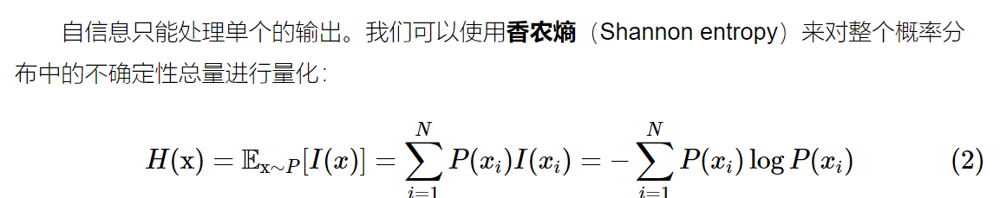

- **KL散度**：$D_{KL}(P||Q) = H(P,Q) - H(P)$，衡量两个分布的差异，不对称

  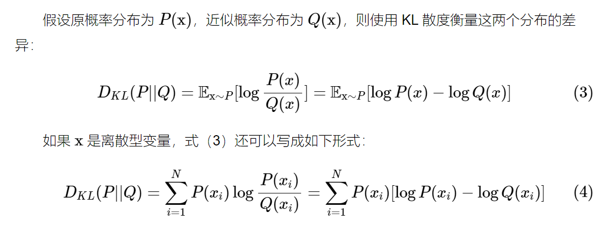

- **交叉熵**：$H(P,Q) = -\sum P(x)\log Q(x)$

  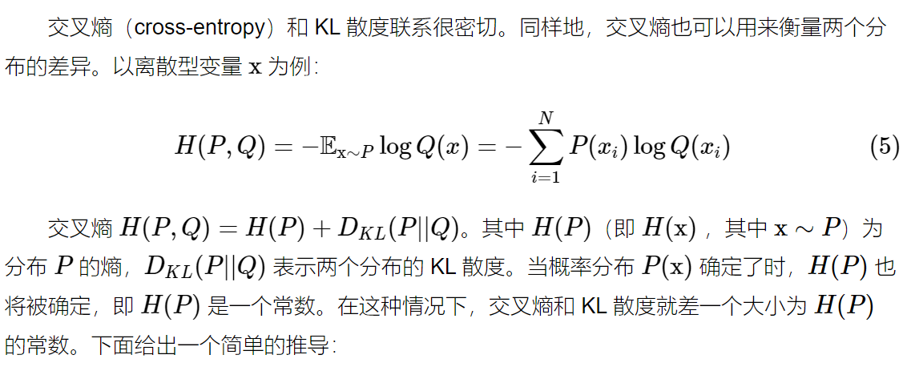

## 评价指标

- **Precision**（查准率）：预测为正中真正为正的比例，减少"存伪"错误
- **Recall**（查全率）：实际为正中被预测为正的比例，减少"去真"错误
- **F1**：Precision和Recall的调和平均

  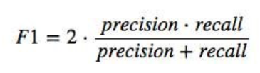

- **AUC-ROC**：ROC曲线（TPR vs FPR）下面积

排序指标：MAP、MRR、NDCG

## 深度学习训练

### Momentum & Adam

- **Momentum**：移动指数加权平均
- **RMSProp**：梯度按元素平方做指数加权平均，解决不同参数梯度量级差异大的问题
- **Adam**：Momentum + RMSProp

  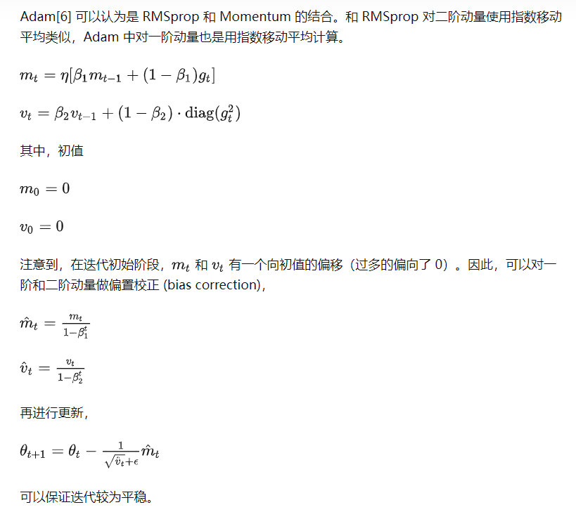

### 梯度爆炸/消失

导数 > 1 → 梯度爆炸；导数 < 1 → 梯度消失。

解决方案：正则化、换激活函数（ReLU）、梯度裁剪、残差连接。

**BatchNorm**：

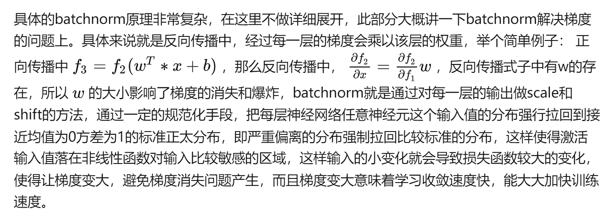

**Residual**：解决梯度消失/爆炸和退化问题。

### BN vs LN

**BN**：在batch维度做归一化；batch size小时效果差；推理时用running mean/var。

**LN**：在单个样本内做归一化；不依赖batch size；Transformer使用LN的原因：NLP中batch内不同位置的token相关性强，不满足BN的独立同分布假设。

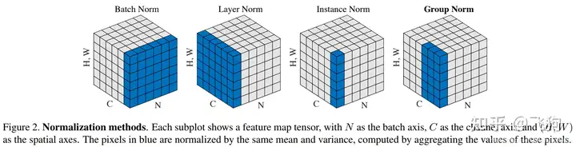

## Transformer 八股

### Attention

$$\text{Attention}(Q,K,V) = \text{softmax}\left(\frac{QK^T}{\sqrt{d_k}}\right)V$$

Scale为什么是 $\sqrt{d_k}$：维度增大时点积方差增大，scale防止softmax进入饱和区导致梯度消失。

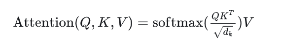

### Multi-Head Attention

多个头形成多个子空间，让模型关注不同方面的信息，类比CNN中的多个卷积核。

### Encoder

- 残差连接：防止退化，灵感来源于LSTM控制门
- Add & Norm：先Add后Norm

### Decoder

- Masked self-attention：mask掉当前位置之后的所有token
- Cross-attention：Q来自decoder，K/V来自encoder输出

### 为什么Transformer效果好

1. 能捕捉长距离依赖
2. 并行计算，比RNN快
3. 网络可以做更深

## BERT

### Byte Pair Encoding (BPE)

迭代合并最高频的字符对；词表大小先增后减，需要取中间值。

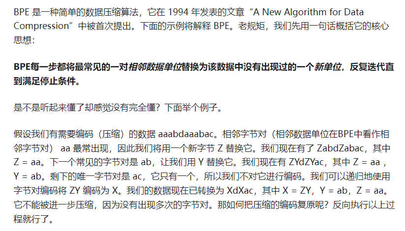

## 快速排序

```python
def quick_sort(lst, i, j):
    if i >= j:
        return
    pivot, lo, hi = lst[i], i, j
    while i < j:
        while i < j and lst[j] >= pivot: j -= 1
        lst[i] = lst[j]
        while i < j and lst[i] <= pivot: i += 1
        lst[j] = lst[i]
    lst[j] = pivot
    quick_sort(lst, lo, i-1)
    quick_sort(lst, i+1, hi)
```

为什么快排比堆排快：cache locality。快排访问连续内存，cache命中率高；堆排需要比较数组前后两半，cache miss频繁。
